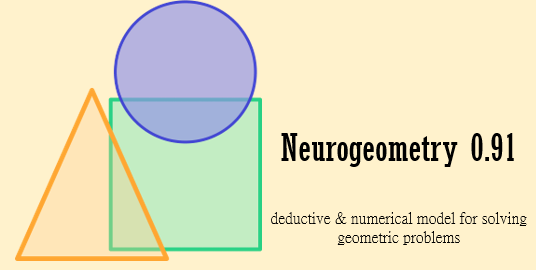
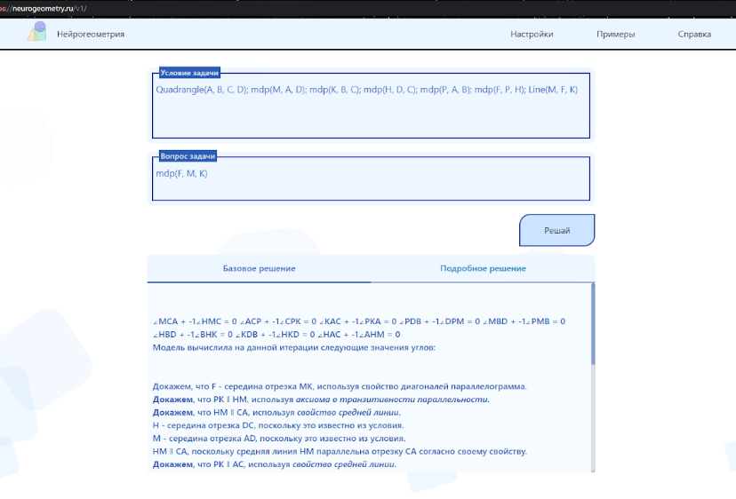
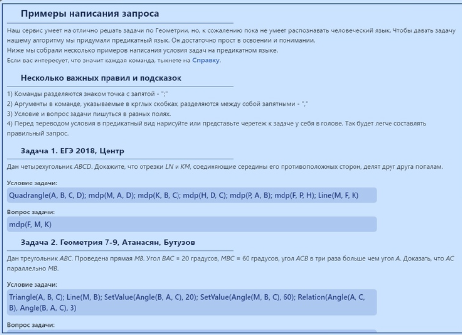
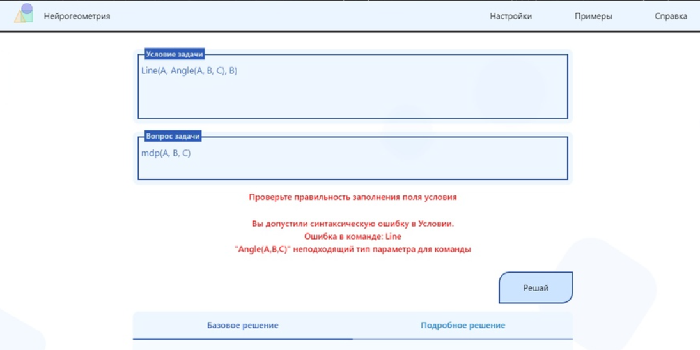
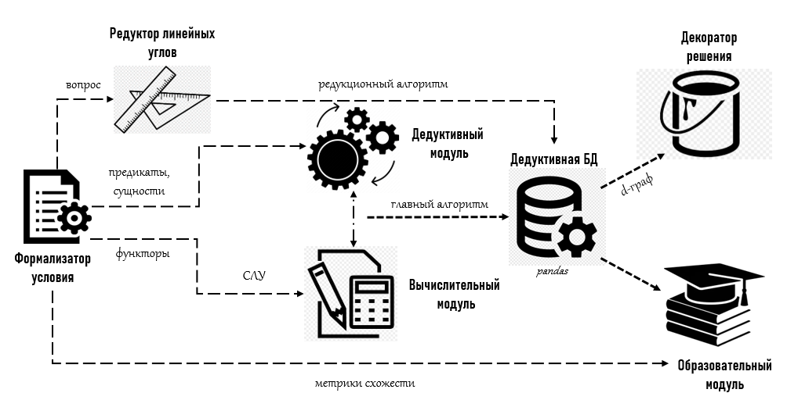
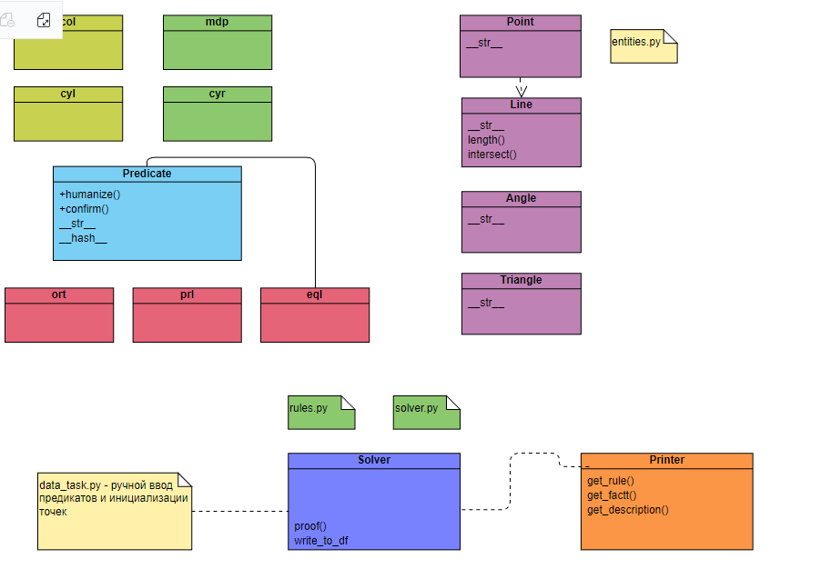
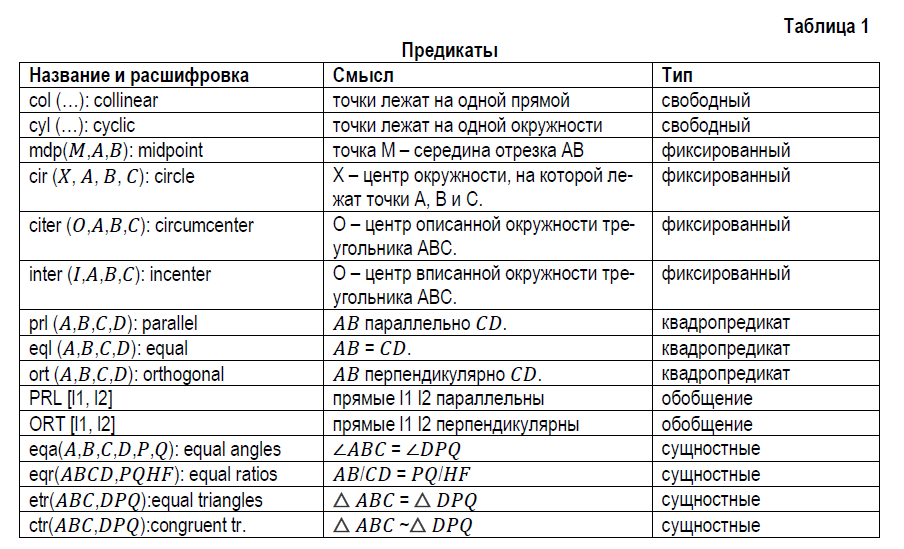

## Сервис автоматизированного решения планиметрических задач "Нейрогеометрия"

## Назначение
Решение задачи по геометрии – сложный творческий процесс, который трудно формализовать и алгоритмизировать, как человеку, так и компьютеру. Ранее созданные модели и концепции имеют свои существенные недостатки, которые не позволяют признать эту проблему до конца решённой и закрытой. Приложение несёт образовательную функцию, и мы ставим следующие цели:
- предварительно можно получить указание с рекомендациями к решению.
- вывести все обнаруженные закономерности и соотношения в задаче.
- получить подробное, полностью интерпретируемое решение.

Разработано совместно с [Konstantin](https://github.com/Kostyak7).
## Примеры работы

Справочная информация и примеры задач для старта:

Программа отслеживает возможные ошибки в синтаксисе:

### Запуск
В директории WEBService находится инструкция.

## Структура проекта

Черновая UML-схема

Дедуктивный датафрейм - результат работы алгоритма. Строками датафрейма является структура вида 'Правило', 'Описание', 'Предпосылки', 'Указатели на предпосылки', 'Факт'.

 
## Подход
Отметим следующие моменты в реализации дедуктивного движка: (*список будет дополняться*)
### Предикатный язык

### Сравнение предикатов
**1-е условие равенства.** Если множества 𝑠-разложений предикатов равны, то и предикаты рав-ны друг другу.

**2-е условие равенства.** Кортежи 𝑠-разложений у равных предикатов равны. (важен порядок расположения элементов).

**Свойство транзитивности** (𝑥 = 𝑦, 𝑦 = 𝑧 ⇒ 𝑥 = 𝑧) выполняется для большинства изученных пре-дикатов. Реализация происходит по следующей схеме: если у двух предикатов есть общий эле-мент 𝑠-разложения, то предикат от уникальных элементов истинен.
